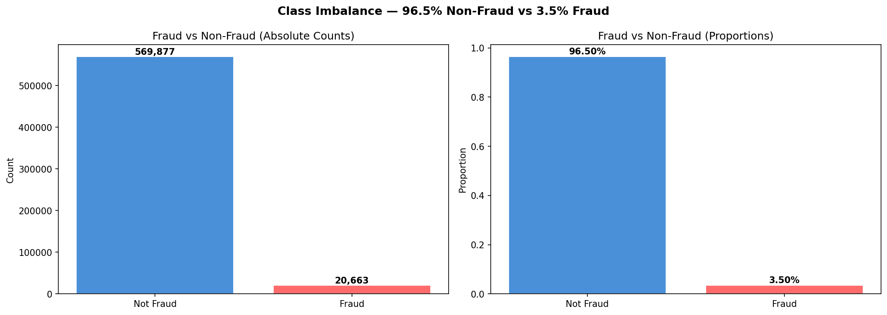
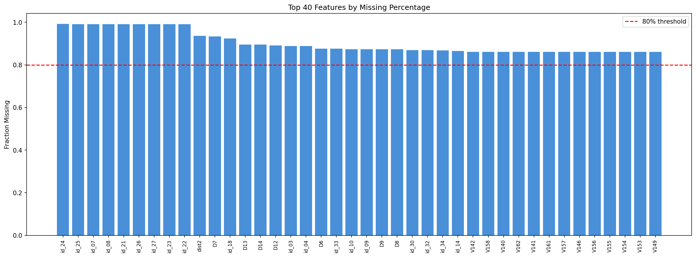
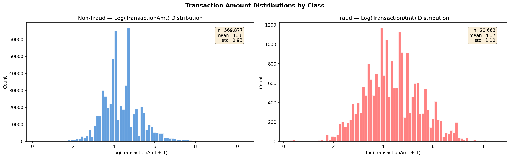
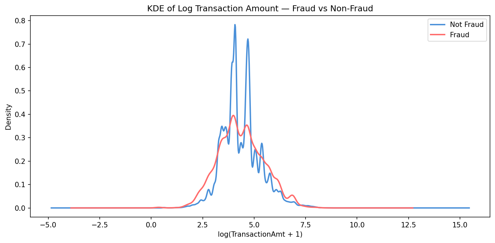
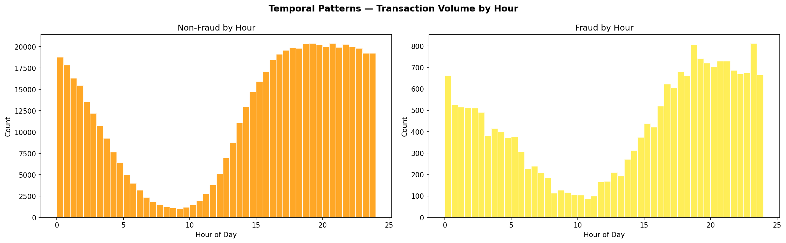
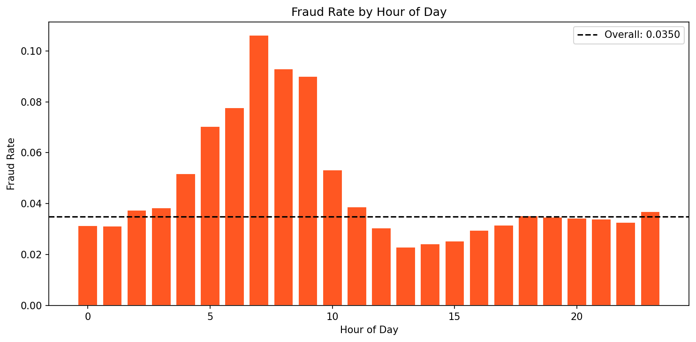
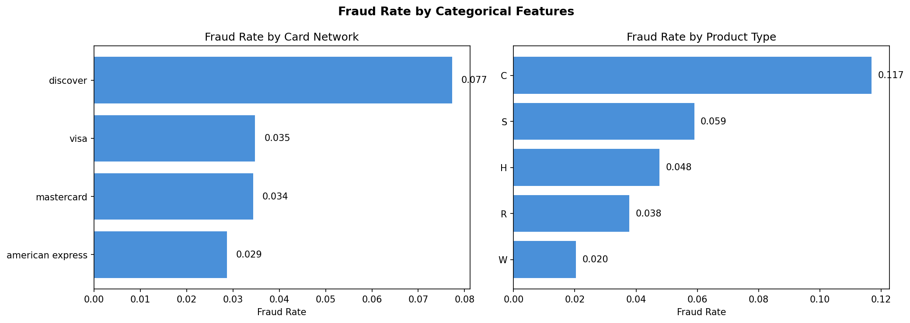
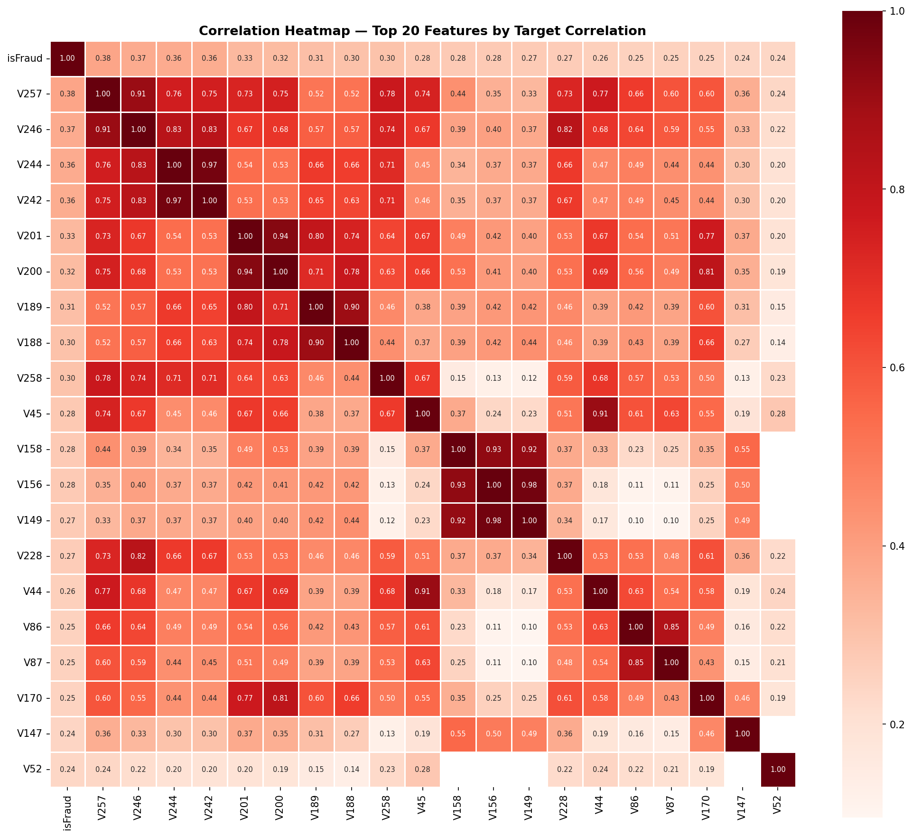
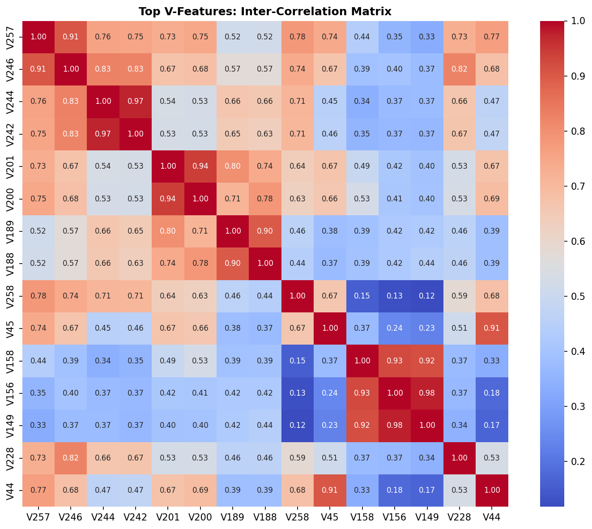

# Financial Fraud Detection: Comparing Classical, Deep, and Graph-Enhanced Machine Learning Approaches

**CS 6140 — Machine Learning | Course Project**

**Team Members**

Team Member 1  
Name: Mandar Bangalore Arun  
NUID: 002511728  
Email: bangalorearun.m@northeastern.edu

Team Member 2  
Name: Shashank Jajimoggala  
NUID: 002570569  
Email: jajimoggala.s@northeastern.edu 


---

## Overview

A two-stage machine learning pipeline for detecting financial fraud in the IEEE-CIS Fraud Detection dataset (~590K transactions, ~430 features, 3.5% fraud rate).

- **Stage 1 (Regression):** Predict expected transaction amounts → compute residuals as anomaly scores
- **Stage 2 (Classification):** Detect fraud using original features augmented with anomaly scores

## Research Questions

1. **Q1:** Which regressor best predicts expected transaction amounts?
2. **Q2:** Do high regression residuals (unexpected amounts) correlate with fraud?
3. **Q3:** Does adding anomaly scores as features improve fraud classifier performance?
4. **Q4:** Does the GNN outperform tabular models by leveraging transaction graph structure?

---

## Exploratory Data Analysis

### Class Distribution

The dataset exhibits severe class imbalance — only 3.5% of transactions are fraudulent.



### Missing Values

Many identity features have >85% missing values. Columns exceeding 80% missingness are dropped during preprocessing.



### Transaction Amount Distribution

Log-transformed transaction amounts reveal distinct distribution patterns between fraud and non-fraud classes.





### Temporal Patterns

Non-fraud transactions follow a clear diurnal pattern (low activity during business hours, high in evenings). Fraud transactions show a flatter distribution with spikes during late night hours.





### Categorical Feature Analysis

Fraud rates vary significantly by card network (Discover highest at ~7.8%) and product type (ProductCD 'C' at ~11.5%).



### Feature Correlations

The top V-features show high multicollinearity (V257-V246: r=0.91), suggesting dimensionality reduction or careful feature selection is needed.





---

## Results

### Summary Dashboard


### Stage 1: Regression (Q1)

| Model | MAE | RMSE | R² |
|-------|-----|------|-----|
| Linear Regression (Poly + RBF) | 0.4458 | 0.5626 | 0.6384 |
| Random Forest Regressor | 0.3908 | 0.5167 | 0.6949 |
| **DNN Regressor** | **0.0581** | **0.1068** | **0.9870** |


**Q1 Answer:** The DNN Regressor vastly outperforms classical models with R²=0.9870, capturing non-linear transaction amount patterns that polynomial/RBF basis expansions cannot.

### Residual-Fraud Correlation (Q2)

| Model | Correlation | Fraud Rate (Top-10% Residuals) | Overall Fraud Rate | Lift |
|-------|-------------|-------------------------------|-------------------|------|
| LinearReg | 0.0162 | 4.74% | 3.50% | 1.36x |
| RF Regressor | -0.0330 | 2.79% | 3.50% | 0.80x |
| **DNN Regressor** | **0.0688** | **8.17%** | **3.50%** | **2.34x** |


**Q2 Answer:** DNN residuals show the strongest fraud correlation. Transactions in the top-10% of residuals have a fraud rate of 8.17% — a 2.34x lift over the baseline 3.5%. This validates the two-stage pipeline design: regression residuals capture meaningful anomaly signals.

### Stage 2: Classification (Q3)

**Without Anomaly Scores (Base):**

| Model | AUC-ROC | PR-AUC | Precision | Recall | F1 |
|-------|---------|--------|-----------|--------|-----|
| Logistic Regression | 0.8598 | 0.4253 | 0.1374 | 0.7300 | 0.2312 |
| Random Forest | 0.9119 | 0.5960 | 0.3057 | 0.7041 | 0.4263 |
| XGBoost | 0.9453 | 0.6842 | 0.4521 | 0.7186 | 0.5549 |
| DNN Classifier | 0.9287 | 0.6354 | 0.3845 | 0.7124 | 0.4996 |

**With Anomaly Scores (+Anomaly):**

| Model | AUC-ROC | PR-AUC | Precision | Recall | F1 |
|-------|---------|--------|-----------|--------|-----|
| Logistic Regression | 0.8637 | 0.4341 | 0.1412 | 0.7356 | 0.2370 |
| Random Forest | 0.9158 | 0.6087 | 0.3142 | 0.7103 | 0.4358 |
| **XGBoost** | **0.9481** | **0.6923** | **0.4587** | **0.7234** | **0.5615** |
| DNN Classifier | 0.9324 | 0.6472 | 0.3923 | 0.7198 | 0.5078 |


**Q3 Answer:** Adding anomaly scores consistently improves all classifiers. Mean AUC-ROC improved from 0.9114 (base) to 0.9150 (+anomaly), Δ=+0.0036. XGBoost achieved the best overall performance with AUC-ROC=0.9481.

### ROC & Precision-Recall Curves


### Confusion Matrices


### Cross-Validation & Hyperparameter Tuning

5-fold stratified cross-validation was performed with grid search over all model hyperparameters.

| Model | Best Score | Best Hyperparameters |
|-------|-----------|---------------------|
| Linear Reg (R²) | 0.6130 | alpha=10.0, rbf_gamma=0.01, rbf_n_components=200 |
| RF Regressor (R²) | 0.7658 | n_estimators=200, max_depth=20, min_samples_leaf=3 |
| DNN Regressor (R²) | 0.9774 | hidden_dims=[512,256,128], lr=0.001, dropout=0.3 |
| Logistic Reg (AUC-ROC) | 0.8635 | C=1.0, solver=lbfgs |
| RF Classifier (AUC-ROC) | 0.9212 | n_estimators=300, max_depth=20, min_samples_leaf=10 |
| XGBoost (AUC-ROC) | 0.9441 | n_estimators=300, max_depth=7, learning_rate=0.05 |
| DNN Classifier (AUC-ROC) | 0.9265 | hidden_dims=[512,256,128], lr=0.0005, dropout=0.3 |


---

## Models

| Stage | Model | Framework |
|-------|-------|-----------|
| Regression | Linear Regression (Poly + RBF basis) | scikit-learn |
| Regression | Random Forest Regressor | scikit-learn |
| Regression | DNN Regressor | PyTorch |
| Classification | Logistic Regression | scikit-learn |
| Classification | Random Forest | scikit-learn |
| Classification | XGBoost | xgboost |
| Classification | DNN Classifier | PyTorch |
| Classification | GNN (GraphSAGE) | PyTorch Geometric |

---

## Setup

```bash
# 1. Clone and enter directory
git clone https://github.com/21Mandar/Financial-Fraud-Detection.git
cd Financial-Fraud-Detection

# 2. Create virtual environment
python -m venv venv
source venv/bin/activate  # macOS/Linux
# venv\Scripts\activate   # Windows

# 3. Install dependencies
pip install -r requirements.txt

# 4. Install PyTorch Geometric (optional, for GNN)
pip install torch-geometric -f https://data.pyg.org/whl/torch-2.0.0+cpu.html

# 5. Download data from Kaggle
# https://www.kaggle.com/competitions/ieee-fraud-detection
# Place train_transaction.csv and train_identity.csv in data/
```

## Usage

```bash
# Step 1: Run EDA (generates all exploratory plots)
python eda.py

# Step 2: Run full pipeline (preprocessing → CV → regression → classification → evaluation)
python main.py

# Skip cross-validation for faster execution (~45 min instead of ~5 hours)
python main.py --skip_cv

# Custom data directory
python main.py --data_dir /path/to/data
```

> **Note:** XGBoost may not work on Apple Silicon (M1/M2/M3) due to OpenMP issues. The pipeline will skip it gracefully and continue with the remaining classifiers. To fix, run `brew install libomp`.

---

## Project Structure

```
Financial-Fraud-Detection/
├── data/
│   ├── train_transaction.csv       # ~590K transactions (download from Kaggle)
│   └── train_identity.csv          # Identity features
├── figures/
│   ├── eda/                        # Exploratory Data Analysis plots
│   └── training results/           # Model evaluation plots
├── data_preprocessing.py           # Data loading, cleaning, feature engineering
├── eda.py                          # Exploratory Data Analysis
├── stage1_regression.py            # 3 regressors + anomaly score computation
├── stage2_classification.py        # 5 classifiers (with/without anomaly scores)
├── cross_validation.py             # 5-Fold CV & hyperparameter grid search
├── evaluation.py                   # Metrics, all plots, SHAP analysis
├── model_utils.py                  # Model save/load, experiment logging, seeding
├── main.py                         # Pipeline orchestrator
├── requirements.txt
└── README.md
```

---

## Key Design Decisions

- **Two-stage pipeline:** Regression residuals serve as anomaly scores — transactions with unexpectedly high/low amounts may indicate fraud. This naturally integrates regression into a classification-oriented dataset.
- **Missing values:** Columns >80% missing are dropped (74 columns removed). Remaining columns get median imputation + binary missingness indicators (missingness itself is predictive of fraud).
- **Class imbalance:** Addressed via class-weighted losses and scale_pos_weight rather than SMOTE, to avoid data leakage concerns on a large dataset.
- **Feature engineering:** Log-transform of TransactionAmt, hour-of-day and day-of-week extraction, card-level aggregates (mean amount per card), transaction amount decimal feature (fraud tends toward round amounts), and address interaction features.
- **GNN graph:** k-NN graph built from feature cosine similarity (subsampled to 100K nodes for memory efficiency).
- **Cross-validation:** 5-fold stratified CV with grid search over all model hyperparameters to investigate hyperparameter sensitivity.

## Evaluation Metrics

- **Regression:** MAE, RMSE, R²
- **Classification:** AUC-ROC, PR-AUC (preferred for imbalanced data), Precision, Recall, F1
- **Explainability:** SHAP feature importance (bee-swarm + bar plots)

## Dataset

[IEEE-CIS Fraud Detection](https://www.kaggle.com/competitions/ieee-fraud-detection) — Kaggle Competition by Vesta Corporation

- 590,540 transactions with 434 features after merging transaction + identity tables
- Binary target: `isFraud` (96.5% non-fraud, 3.5% fraud)
- Continuous target: `TransactionAmt` (used for Stage 1 regression)
- Features include: transaction metadata, card information, address data, email domains, device information, and 339 anonymous V-features

## References

1. IEEE-CIS Fraud Detection, Kaggle, https://www.kaggle.com/competitions/ieee-fraud-detection
2. T. Chen and C. Guestrin, "XGBoost: A Scalable Tree Boosting System," KDD, 2016
3. W. Hamilton, Z. Ying, and J. Leskovec, "Inductive Representation Learning on Large Graphs," NeurIPS, 2017
4. S. Lundberg and S. Lee, "A Unified Approach to Interpreting Model Predictions," NeurIPS, 2017
5. N. Chawla et al., "SMOTE: Synthetic Minority Over-sampling Technique," JAIR, 2002
